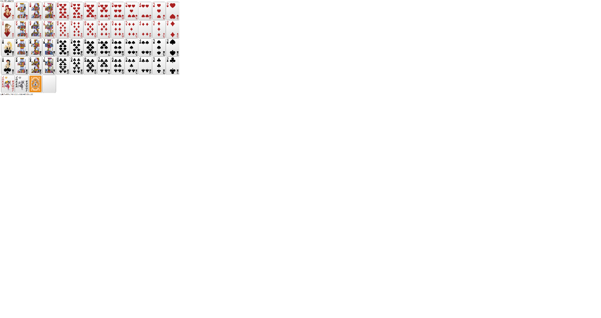

# poker.code
a try to the traditional chinese is 情怀, but fustrate a lot of days.
 
this idea is from https://github.com/Tairraos/Poker.JS && https://github.com/wish-wish/ThePoker_zd  and https://github.com/aydos/svgpath
 
some picture is from zd poker , which scan it from print.  and some from internet
 
</img>